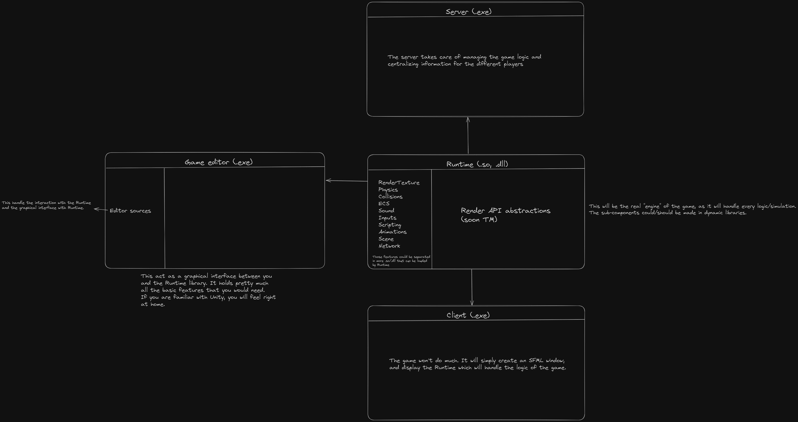

# R-Type

This project involves building a game engine. \
To show the use of it we have reproduced a network game: the R-Type

## Project architecture

The project is divided into four main parts:
- Runtime
- Editor
- Client
- Server

**Runtime**: It is this part which contains the game engine and the network lib. \
**Editor**: With this project, create your own games easily thanks to an easy and easy-to-use graphical interface! \
**Client**: If you're creating a network game, use our client so you can connect directly to your server! [How to use client](docs/Client.md) \
**Server**: Every network game must have a server managing the players ! [How to use server](docs/Server.md)

## How to install

### For non developer/user

**You can download the latest installer, for windows or linux [here](https://github.com/Sinan-Karakaya/R-Type/releases).**

This installer contains Server, Client, Editor & Runtime (obviously) !

### For developer

Firstly you need to install vcpkg and set the VCPKG_ROOT environnement variable to the directory where you installed vcpkg. The steps
depends on your operating system.

- [vcpkg](https://vcpkg.io/en/getting-started)
- [Environnement variable on Windows](https://phoenixnap.com/kb/windows-set-environment-variable#:~:text=Follow%20the%20steps%20to%20set%20environment%20variables%20using,the%20New%20User%20Variable%20prompt%20and%20click%20OK.)
- [Environnement variable on Linux/Mac](https://phoenixnap.com/kb/linux-set-environment-variable#:~:text=Set%20an%20Environment%20Variable%20in%20Linux%20Permanently%201,file%20in%20the%20%2Fetc%2Fprofile.d%20folder%3A%20...%20%C3%89l%C3%A9ments%20suppl%C3%A9mentaires)

Once you installed vcpkg, in the root of the repository, do the command:

`vcpkg install`

_If vcpkg is not found, you might need to add the path to vcpkg to the PATH environnement_

Then you can do as follow:

```
mkdir build
cmake --preset=default -S . -B ./build/
cmake --build ./build/
cd build

# to launch the client
./rtype_client          # with a .exe at the end on Windows

# to launch the editor
./rtype_editor          # with a .exe at the end on Windows

# to launch the server
./rtype_server          # with a .exe at the end on Windows
```

If you want to build release:
```
mkdir build
cmake --preset=release -S . -B ./build/
cmake --build ./build/
```

*What is difference between default and release ?* \
The default preset builds the project in debug mode, allowing easier debugging. However, this mode can cause slowdowns in the runtime.

For a release version, use the release preset!